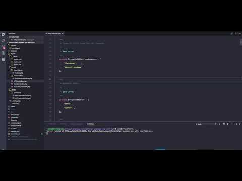

## Silverstripe News JSON API App With Test

[](https://circleci.com/gh/laminbarrow/silverstripe-news-jsonapi-app-with-test)

This is a proof of concept app showcasing a custom built JSON REST API Silverstripe4 news app. It's a Silverstripe 4.1 application and you'll need to have a PHP 7 environment with the requirements to run Silverstripe in order to run it. 

It comes with a wide test-suite covering and verifying most of the integrated functionalities of the application. 

I've made a video showing this app and you can find it on youtube at https://youtu.be/Dh-xmlcWSnw

[](https://youtu.be/Dh-xmlcWSnw "Silverstripe 4 REST JSON NEWS API APP")


**Installation**

Please refer to the Silverstripe installation and requirements before running this and  make sure that `composer` - https://getcomposer.org/ is downloaded and install in your environment then run

`composer install`

Next, if you are in a development environment, run ` vendor/bin/serve` to run a built-in PHP server served version of the app and you'd be up and running.

Finally, go to `http://localhost:8080/` and you should be greeted with the Silverstripe installer if you don't already have the necessary database details in your own `.env` file. I've included a sample `.evn.sample` file and you can rename that to `.env`, edit the settings in it and use it as a base for your own setup.


### The Routes

There is one main route in this Silverstripe4 and that is defined in the `mysite\_config/routes.yml` routes file

```yaml
SilverStripe\Control\Director:
  rules:
    'api//$Action/$ID/$Name': 'mysite\APIController'
    '': 'mysite\APIController'
```

In its base setup, the app is configured to respond to the following HTTP REST and API route

| Name           | HTTP Verb   | Route           |
| -------------- | ----------- | --------------- |
| Get Articles   | GET         | api/articles    |
| Create Article | POST        | api/articles    |
| Edit Article   | POST  / PUT | api/article/$ID |
| Delete Article | DELETE      | api/article/$ID |

#### The index route

The index route (`/api/`) should send back and JSON response like the one below.

```yaml
[
"The News Articles JSON API Server is online :)"
]
```


and sending a `GET` request to the `api/articles` route should respond with a JSON response similar to the one below.

```php
[
{
"ClassName": "mysite\\DataObjects\\Article",
"LastEdited": "2018-06-21 21:13:47",
"Created": "2018-06-21 21:13:47",
"Title": "Assumenda temporibus voluptas adipisci ipsam numquam et architecto.",
"Content": "Omnis porro molestias quis neque. Amet eum repellat autem est vitae non voluptate. Porro saepe aut eius suscipit qui qui.",
"ID": 1,
"RecordClassName": "mysite\\DataObjects\\Article"
},
{
"ClassName": "mysite\\DataObjects\\Article",
"LastEdited": "2018-06-21 21:13:47",
"Created": "2018-06-21 21:13:47",
"Title": "Iste a qui veritatis alias non enim.",
"Content": "Fugit at et sed dolores. Qui libero quae ullam consectetur sunt laborum ipsam. Sunt voluptatem est ut quis.",
"ID": 2,
"RecordClassName": "mysite\\DataObjects\\Article"
},
{
"ClassName": "mysite\\DataObjects\\Article",
"LastEdited": "2018-06-21 21:13:47",
"Created": "2018-06-21 21:13:47",
"Title": "Nulla error harum enim beatae ea.",
"Content": "Cumque consectetur doloremque neque repellat et. Illo sunt doloribus ratione laboriosam neque harum iste asperiores. Eaque aut et doloremque praesentium.",
"ID": 3,
"RecordClassName": "mysite\\DataObjects\\Article"
},
{
"ClassName": "mysite\\DataObjects\\Article",
"LastEdited": "2018-06-21 21:13:47",
"Created": "2018-06-21 21:13:47",
"Title": "Iure corrupti facere sint perspiciatis aliquid omnis.",
"Content": "Dolorem optio est illo. Reiciendis nihil voluptatem enim a in delectus. In quia beatae qui iusto aut.",
"ID": 4,
"RecordClassName": "mysite\\DataObjects\\Article"
},
{
"ClassName": "mysite\\DataObjects\\Article",
"LastEdited": "2018-06-21 21:13:47",
"Created": "2018-06-21 21:13:47",
"Title": "Consequuntur debitis enim non et non aut sed.",
"Content": "Ratione deserunt quod ea quasi tenetur. Et voluptatem earum et similique. Esse ratione consequatur dolor quod iusto. Sit possimus aliquid dolorem.",
"ID": 5,
"RecordClassName": "mysite\\DataObjects\\Article"
}
]
```


### Validation and Fillable Fields

The application also comes with input validate so you cannot fill in values except that the API allows you to fill them in and you'll get a response like the snippet below if you try to send a `POST` request to `create` or `edit` and article.

```yaml
[
    "Title is required",
    "Title2 is not in the fillable fields array"
]
```

In this case, it is showing that the `Title` of the article is required and it's also complaining about `Title2` because that key is not in the API `fillableFields` fields array.


### Running The Test

The app has been setup with fixtures to load some example data to facilitate the functional/integrated test of the API. An in-memory SQLITE3 database will be created when running the test.

To run the test for this app. Just type the command below in your command like

`vendor/bin/phpunit`

I've also setup CircleCI to run the test for this app in the cloud and you can visit https://circleci.com/gh/laminbarrow/silverstripe-news-jsonapi-app-with-test to see the status of the test that was performed.
